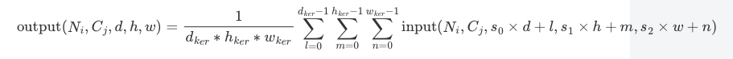

# mindspore.nn.AvgPool3d
AvgPool是在神经网络中一种常见的池化操作，也叫做子采样（subsampling）和降采样（downsampling）。
池化层通常放在卷积层的后面，可以对数据降维、减少网络参数和防止过拟合现象，并加快模型的运行速度。本篇介绍3D平均池化运算的使用方法。
```python
class mindspore.nn.AvgPool3d(kernel_size=1, stride=1, pad_mode='valid', padding=0, ceil_mode=False, count_include_pad=True, divisor_override=None)
```

## 输入和输出
输入的Tensor尺寸为（N, C<sub>in</sub>, D<sub>in</sub>, H<sub>in</sub>, W<sub>in</sub>）或者（C, D<sub>in</sub>, H<sub>in</sub>, W<sub>in</sub>）。 
输出的Tensor尺寸为（N, C<sub>out</sub>, D<sub>out</sub>, H<sub>out</sub>, W<sub>out</sub>）或者（C, D<sub>out</sub>, H<sub>out</sub>, W<sub>out</sub>）。  
计算公式为：   
    

## 参数
**kernel_size** (Union[int, tuple[int]]，可选) - 指定池化核尺寸大小。如果为整数或单元素tuple，则同时代表池化核的深度，高度和宽度。如果为tuple且长度不为 1 ，其值必须包含三个正整数，分别表示池化核的深度，高度和宽度。默认值： 1 。

**stride** (Union[int, tuple[int]]，可选) - 池化操作的移动步长。如果为整数或单元素tuple，则同时代表池化核的深度，高度和宽度方向上的移动步长。如果为tuple且长度不为 1 ，其值必须包含三个整数值，分别表示池化核的深度，高度和宽度方向上的移动步长。取值必须为正整数。默认值： 1 。

**pad_mode** (str，可选) - 指定填充模式，填充值为0。可选值为 "same" ， "valid" 或 "pad" 。默认值： "valid" 。

- "same"：在输入的深度、高度和宽度维度进行填充，使得当 stride 为 1 时，输入和输出的shape一致。待填充的量由算子内部计算，若为偶数，则均匀地填充在四周，若为奇数，多余的填充量将补充在前方/底部/右侧。如果设置了此模式， padding 必须为0。

- "valid"：不对输入进行填充，返回输出可能的最大深度、高度和宽度，不能构成一个完整stride的额外的像素将被丢弃。如果设置了此模式， padding 必须为0。

- "pad"：对输入填充指定的量。在这种模式下，在输入的深度、高度和宽度方向上填充的量由 padding 参数指定。如果设置此模式， padding 必须大于或等于0。

**padding** (Union(int, tuple[int], list[int])，可选) - 池化填充值，只有 pad_mode 为”pad”时才能设置为非 0 。默认值： 0 。只支持以下情况：

- padding 为一个整数或包含一个整数的tuple/list，此情况下分别在输入的前后上下左右六个方向进行 padding 次的填充。

- padding 为一个包含三个int的tuple/list，此情况下在输入的前后进行 padding[0] 次的填充，上下进行 padding[1] 次的填充，在输入的左右进行 padding[2] 次的填充。

**ceil_mode** (bool，可选) - 若为 True，使用ceil来计算输出shape。若为 False ，使用floor来计算输出shape。默认值： False。

**count_include_pad** (bool，可选) - 平均计算是否包括零填充。默认值： True。

**divisor_override** (int，可选) - 如果被指定为非0参数，该参数将会在平均计算中被用作除数，否则将会使用 kernel_size 作为除数，默认值： None。

\* stride=kernel size的情况属于非重叠池化，如果stride<kernel size 则属于重叠池化。重叠池化相比于非重叠池化不仅可以提升预测精度，同时在一定程度上可以缓解过拟合。

## 与torch.nn.GroupNorm的区别
与torch.nn.GroupNorm相比，新增了参数pad_mode,当padding不为0时，pad_mode为“pad”时与torch实现一致。
其他参数与torch功能保持一致。

## AvgPool与MaxPool的选择方法
最大池化与平均池化是神经网络中常见的两种池化方式。   
最大池化，是取池化区域内的最大值，这种方式对纹理轮廓等特征比较敏感，可以过滤掉比较多的无用信息。特点更鲜明。   
平均池化，是取池化区域内的平均值，对背景信息更加敏感，若我们需要的对象偏向于整体特性，防止丢失太多的高维信息更适合用平均池化。

## 样例
输入为batch size为1， channel为1，deepth为4，height为4，width为4的Tensor。   
[[[[ 0,  1,  2,  3],   
   [ 4,  5,  6,  7],   
   [ 8,  9, 10, 11],   
   [12, 13, 14, 15]]]]   
设置nn.AvgPool2d的kernel_size=2，即一个深、宽和高都为2的核。stride=2，即移动步长为2。
即对下列组合取平均值：   
[[[1,2], [5,6]],[[1,2], [5,6]]] avg = 3.5   
[[[3,4], [7,8]], [[3,4], [7,8]]]avg = 5.5   
[[[9,10], [13,14]], [[9,10], [13,14]]] avg = 11.5   
[[[11,12], [15,16]], [[11,12], [15,16]]] avg = 13.5   
与下列代码实现一致：

```python
import mindspore as ms
from mindspore import Tensor
import numpy as np

pool = ms.nn.AvgPool3d(kernel_size=2, stride=2)
x =  Tensor([[[[[1, 2, 3, 4],
               [5, 6, 7, 8],
               [9, 10, 11, 12],
               [13, 14, 15, 16]], 

               [[1, 2, 3, 4],
               [5, 6, 7, 8],
               [9, 10, 11, 12],
               [13, 14, 15, 16]],

               [[1, 2, 3, 4],
               [5, 6, 7, 8],
               [9, 10, 11, 12],
               [13, 14, 15, 16]],

               [[1, 2, 3, 4],
               [5, 6, 7, 8],
               [9, 10, 11, 12],
               [13, 14, 15, 16]]]]], ms.float32)
print(x.shape)
# (1, 1, 4, 4, 4)
output = pool(x)
print(output.shape)
# (1, 1, 2, 2, 2)
print(output)
# [[[[[ 3.5  5.5]
#     [11.5 13.5]]

#    [[ 3.5  5.5]
#     [11.5 13.5]]]]]
```


```python
import mindspore as ms
from mindspore import Tensor
import numpy as np

pool = ms.nn.AvgPool2d(kernel_size=2, stride=2)
x = Tensor([[[[ 0,  1,  2,  3],
              [ 4,  5,  6,  7],
              [ 8,  9, 10, 11],
              [12, 13, 14, 15]]]], ms.float32)
output = pool(x)
print(output.shape)
# (1, 1, 2, 2)

print(output)
# [[[[ 2.5  4.5]
#    [10.5 12.5]]]]
```