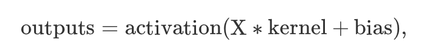

# mindspore.nn.Dense
线性层又叫全连接层,每个神经元与上一层所有神经元连接。主要用于神经网络的最后一层，通过矩阵相乘的运算，输出out_channels大小的预测值，即output。

```python
class mindspore.nn.Dense(in_channels, out_channels, weight_init=None, bias_init=None, has_bias=True, activation=None, dtype=mstype.float32)
```

## 输入和输出：
输入的Tensor尺寸为（任意维度，in_channels）。   
输出的Tensor尺寸为（任意维度，out_channels）。    
计算公式：   
    
其中X为输入，activation为激活函数，kernel为权重矩阵，bias为偏执向量。


## 参数：
**in_channels** (int) - Dense层输入Tensor的空间维度。   
**out_channels** (int) - Dense层输出Tensor的空间维度。   
**weight_init** (Union[Tensor, str, Initializer, numbers.Number]) - 权重参数的初始化方法。数据类型与 x 相同。str的值引用自函数 initializer。默认值：None ，权重使用HeUniform初始化。   
**bias_init** (Union[Tensor, str, Initializer, numbers.Number]) - 偏置参数的初始化方法。数据类型与 x 相同。str的值引用自函数 initializer。默认值：None ，偏差使用Uniform初始化。   
**has_bias** (bool) - 是否使用偏置向量  。默认值： True 。   
**activation** (Union[str, Cell, Primitive, None]) - 应用于全连接层输出的激活函数。可指定激活函数名，如’relu’，或具体激活函数，如 mindspore.nn.ReLU 。默认值： None 。   
**dtype** (mindspore.dtype) - Parameter的数据类型。默认值： mstype.float32 。  

## 与torch.nn.Linear的差异
1. torch.nn.Linear中没有weight_init和bias_init参数，默认weight和bias都由均匀分布初始化。mindspore.nn.Dense中weight和bias可以指定初始化方式，默认weight是HeUniform，bias是Uniform初始化方式。   
2. mindspore.nn.Dense中的activation参数，如果指定了激活函数，在输出数据前可以应用。而torch.nn.Dense则没有该参数。   
3. 其余参数与torch.nn.Linear功能一致。   
### 样例
输入为一个大小为[2,3]的Tensor：   
[[180, 234, 154], 
 [244, 48, 247]]
当我们想输出一个大小为[2,4]的Tensor时, 需要构造一个大小为[3,4]的矩阵来与输入矩阵做乘法。
全连接层的作用就是简化这一操作，即配置一个转置后可以与输入矩阵进行矩阵乘法的weight矩阵，以及偏置矩阵bias，从而获得一个目标大小的输出矩阵。

#### mindspore.nn.Dense
```python
import mindspore
from mindspore import Tensor, nn
import numpy as np

x = Tensor(np.array([[180, 234, 154], [244, 48, 247]]), mindspore.float32)
net = nn.Dense(3, 4)
output = net(x)
print(net.weight.asnumpy())
# [[-0.10938855 -0.56662524 -0.00735029]
#  [-0.38269132 -0.324938   -0.03557403]
#  [ 0.17404251 -0.4344387  -0.09820215]
#  [-0.495488    0.30242598 -0.40080398]]
print(net.weight.shape)
# (4, 3)
print(net.bias.asnumpy())
# [ 0.16285007 -0.49826244 -0.380412    0.16626143]
print(net.bias.shape)
# (4,)
print(output.shape)
# (2, 4)
print(output)
# [[-153.24933   -150.89658    -85.83455    -79.97771  ]
#  [ -55.54149   -118.25876     -3.0230265 -205.21494  ]]
```
#### torch.nn.Linear
```python
import torch
from torch import nn
import numpy as np
from torch.nn.parameter import Parameter
net = nn.Linear(3, 4)
x = torch.tensor(np.array([[180, 234, 154], [244, 48, 247]]), dtype=torch.float)
# 为了与mindspore更方便对比，此处我们固定weight和bias为上述mindspore.nn.Dense中的weight和bias。
w = torch.tensor([[-0.10938855, -0.56662524, -0.00735029],
                  [-0.38269132, -0.324938,   -0.03557403],
                  [ 0.17404251, -0.4344387,  -0.09820215],
                  [-0.495488,   0.30242598, -0.40080398]])
b = torch.tensor([0.16285007, -0.49826244, -0.380412, 0.16626143])
net.weight = Parameter(w)
net.bias = Parameter(b)
output = net(x)
print(output.detach().numpy().shape)
# (2, 4)
print(output)
# tensor([[-153.2493, -150.8966,  -85.8345,  -79.9777],
#         [ -55.5415, -118.2588,   -3.0230, -205.2149]],
#        grad_fn=<AddmmBackward0>)
```