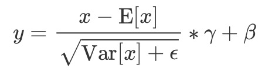
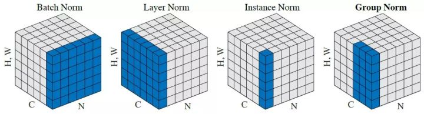

# mindspore.nn.LayerNorm
LaryerNorm是深度学习中常用的归一化方式。他的作用是在神经网络训练中对输入数据进行归一化，他将输入归一化到均值为0和方差为1的分布中，来防止梯度消失和爆炸，并提高模型的泛化能力。   
LayerNorm是针对layer维度进行标准化通常在NLP领域的任务，都会使用LayerNorm作为标准化层。
```python
class mindspore.nn.LayerNorm(normalized_shape, begin_norm_axis=- 1, begin_params_axis=- 1, gamma_init='ones', beta_init='zeros', epsilon=1e-07, dtype=mstype.float32)
```
## 输入和输出
输入的Tensor尺寸为（x<sub>1, x<sub>2</sub></sub>, ...任意附加维度）。
输出为归一化后的的Tensor，具有与输入相同的shape和数据类型。      
计算公式为：   
    

## 参数
**normalized_shape** (Union(tuple[int], list[int])) - 沿轴 begin_norm_axis … R - 1 执行归一化。其中R为输入 x 的维度大小。

**begin_norm_axis** (int) - 归一化开始计算的轴，取值范围是[-1, R)。默认值： -1 。

**begin_params_axis** (int) - 指定输入参数  需进行层归一化的开始轴，取值范围是[-1, R)。默认值： -1 。

**gamma_init** (Union[Tensor, str, Initializer, numbers.Number]) -  参数的初始化方法。str的值引用自函数 initializer ，包括 'zeros' 、 'ones' 、 'xavier_uniform' 、 'he_uniform' 等。默认值： 'ones' 。

**beta_init** (Union[Tensor, str, Initializer, numbers.Number]) -  参数的初始化方法。str的值引用自函数 initializer ，包括 'zeros' 、 'ones' 、 'xavier_uniform' 、 'he_uniform' 等。默认值： 'zeros' 。

**epsilon** (float) - 添加到分母中的值（），以确保数值稳定。默认值： 1e-7 。

**dtype** (mindspore.dtype) - Parameters的dtype。默认值： mstype.float32 。

## 与torch.nn.GroupNorm的区别
torch.nn.LayerNorm不能设置begin_norm_axis、begin_params_axis、gamma_init、beta_init参数。mindspore.nn.LayerNorm中没有elementwise_affine参数，当mindspore中固定使用可学习参数。

## 常见的归一化方式对比：
下图展示了四种常见的归一化方式，其中N为batch size, C为channel, H和W为height和width。
     

BatchNorm：batch方向做归一化，算N * H * W的均值和方差。      
LayerNorm：channel方向做归一化，算C * H * W的均值和方差。   
InstanceNorm：一个channel内做归一化，算H * W的均值和方差。   
GroupNorm：将channel方向分group，然后每个group内做归一化，算(C/G) * H * W的均值和方差。详见[mindspore.nn.GroupNorm接口实践](./../nn.GroupNorm/mindspore.nn.GroupNorm.md)。   

## 样例1: 对最后一维进行归一化
输入的tensor尺寸为[4, 8]。   
 [[1, 0, 0, 2, 3, 4, 1, 2 ],   
  [-2, 9, 7, 5, 2, 3, 4, 2],   
  [1, 2, -1, 0, 1, 2, 3, 5],   
  [4, 7,-6, 4, 1, 4, 1, 5 ]]    

我们设置mindspore.nn.LayerNorm的normalized_shape参数为（8，），即输入的最后一个维度的尺寸，因此mindspore.nn.LayerNorm会在下述范围内做归一化处理：   

Batch1_Group1: [1, 0, 0, 2, 3, 4, 1, 2 ] 均值：1.625 方差: 1.7343     
Batch1_Group2: [-2, 9, 7, 5, 2, 3, 4, 2] 均值：3.75  方差：9.9375    
Batch2_Group3: [1, 2, -1, 0, 1, 2, 3, 5] 均值：1.625 方差：2.9843      
Batch2_Group4: [4, 7,-6, 4, 1, 4, 1, 5 ] 均值：2.5   方差：13.75   
代入计算公式后，可得出与如下mindspore.nn.LayerNorm与torch.nn.LayerNorm相近的答案（output还受可学习参数的影响）。

### mindspore.nn.LayerNorm样例
```python 
import mindspore as ms
from mindspore import Tensor
import numpy as np
x =  Tensor([[1, 0, 0, 2, 3, 4, 1, 2 ],
             [-2, 9, 7, 5, 2, 3, 4, 2],
             [1, 2, -1, 0, 1, 2, 3, 5],
             [4, 7,-6, 4, 1, 4, 1, 5 ]], ms.float32)
print(x.shape)
# (4, 8)
layer_norm_op = ms.nn.LayerNorm(normalized_shape=(8,))
output = layer_norm_op(x)
print(output)
# [[-0.47457898 -1.2339053  -1.2339053   0.2847474   1.0440738   1.8034002
#   -0.47457898  0.2847474 ]
#  [-1.8240187   1.6654084   1.0309671   0.3965258  -0.55513614 -0.23791549
#    0.07930516 -0.55513614]
#  [-0.3617873   0.21707238 -1.5195066  -0.94064695 -0.3617873   0.21707238
#    0.79593205  1.9536514 ]
#  [ 0.40451992  1.2135597  -2.2922797   0.40451992 -0.40451992  0.40451992
#   -0.40451992  0.6741999 ]]
```
### torch.nn.LayerNorm样例
```python 
import torch
import torch.nn as nn
inputs = torch.tensor([[[1, 0, 0, 2, 3, 4, 1, 2 ],
                        [-2, 9, 7, 5, 2, 3, 4, 2],
                        [1, 2, -1, 0, 1, 2, 3, 5],
                        [4, 7,-6, 4, 1, 4, 1, 5 ]]], dtype=torch.float32)
print(inputs.shape)
# torch.Size([1, 4, 8])
m1 = nn.LayerNorm(8)
output = m1(inputs)
print(output)
# tensor([[[-0.4746, -1.2339, -1.2339,  0.2847,  1.0441,  1.8034, -0.4746,
#            0.2847],
#          [-1.8240,  1.6654,  1.0310,  0.3965, -0.5551, -0.2379,  0.0793,
#           -0.5551],
#          [-0.3618,  0.2171, -1.5195, -0.9406, -0.3618,  0.2171,  0.7959,
#            1.9536],
#          [ 0.4045,  1.2136, -2.2923,  0.4045, -0.4045,  0.4045, -0.4045,
#            0.6742]]], grad_fn=<NativeLayerNormBackward0>)
```

## 样例2: 对最后N维进行归一化
输入的tensor尺寸为[2, 2, 4, 2]。   
[[[[1,0], [0,2], [3,4], [1,2]],
  [[-2,9], [7,5],[2,3], [4,2]]],

[[[1,2], [-1,0], [1,2], [3,5]],
  [[4,7], [-6,4], [1,4], [1,5]]]]
如果我们想对最后两个维度[4,2]做归一化处理, 归一化的范围应该如下所示：
[[1,0], [0,2], [3,4], [1,2]]    均值：1.625 方差: 1.7343 
[[-2,9], [7,5],[2,3], [4,2]]    均值：3.75  方差：9.9375  
[[1,2], [-1,0], [1,2], [3,5]]   均值：1.625 方差：2.9843 
[[4,7], [-6,4], [1,4], [1,5]]]  均值：2.5   方差：13.75  

### mindspore.nn.LayerNorm样例
mindspore.nn.LayerNorm中因为begin_norm_axis和begin_params_axis的默认值为-1，即默认对输入的最后一维进行归一化处理。
在进行对多维归一化处理是，需要改写这两个参数来匹配上input的维度。   
例：输入的维度为4，我们想在最后两个维度上做归一化时（即normalized_shape（[4,2]），begin_norm_axis和begin_params_axis的值必须填为2，即在输入上第二维及以后的维度上做归一化。
假设想在最后三个维度上做归一化时，begin_norm_axis和begin_params_axis的值需要填为1，即在输入上第1维及以后的维度上做归一化。
```python
import mindspore as ms
import numpy as np
x = ms.Tensor([[[[1,0], [0,2], [3,4], [1,2]],
                [[-2,9], [7,5],[2,3], [4,2]]],

               [[[1,2], [-1,0], [1,2], [3, 5]],
                [[4,7], [-6,4], [1,4], [1,5]]]], ms.float32)

m = ms.nn.LayerNorm([4,2], begin_norm_axis=2, begin_params_axis=2)
output = m(x)
print(output)
# [[[[-0.47457898 -1.2339053 ]
#    [-1.2339053   0.2847474 ]
#    [ 1.0440738   1.8034002 ]
#    [-0.47457898  0.2847474 ]]

#   [[-1.8240187   1.6654084 ]
#    [ 1.0309671   0.3965258 ]
#    [-0.55513614 -0.23791549]
#    [ 0.07930516 -0.55513614]]]


#  [[[-0.3617873   0.21707238]
#    [-1.5195066  -0.94064695]
#    [-0.3617873   0.21707238]
#    [ 0.79593205  1.9536514 ]]

#   [[ 0.40451992  1.2135597 ]
#    [-2.2922797   0.40451992]
#    [-0.40451992  0.40451992]
#    [-0.40451992  0.6741999 ]]]]
```

### torch.nn.LayerNorm样例
torch中没有begin_norm_axis和begin_params_axis参数，会根据normalized_shape自动识别。
```python
import torch
import torch.nn as nn
inputs = torch.tensor([[[[1,0], [0,2], [3,4], [1,2]],
                       [[-2,9], [7,5],[2,3], [4,2]]],

                       [[[1,2], [-1,0], [1,2], [3, 5]],
                        [[4,7], [-6,4], [1,4], [1,5]]]], dtype=torch.float32)
print(inputs.shape)
# torch.Size([2, 2, 4, 2])
m1 = nn.LayerNorm([4,2])
output = m1(inputs)
print(output)
# tensor([[[[-0.4746, -1.2339],
#           [-1.2339,  0.2847],
#           [ 1.0441,  1.8034],
#           [-0.4746,  0.2847]],

#          [[-1.8240,  1.6654],
#           [ 1.0310,  0.3965],
#           [-0.5551, -0.2379],
#           [ 0.0793, -0.5551]]],


#         [[[-0.3618,  0.2171],
#           [-1.5195, -0.9406],
#           [-0.3618,  0.2171],
#           [ 0.7959,  1.9536]],

#          [[ 0.4045,  1.2136],
#           [-2.2923,  0.4045],
#           [-0.4045,  0.4045],
#           [-0.4045,  0.6742]]]], grad_fn=<NativeLayerNormBackward0>)
```