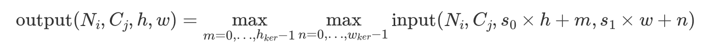

# mindspore.nn.MaxPool2d
MaxPool是在神经网络中一种常见的池化操作，也叫做子采样（subsampling）和降采样（downsampling）。
池化层通常放在卷积层的后面，可以对数据降维、减少网络参数和防止过拟合现象，并加快模型的运行速度。
本篇介绍2D平均池化运算的使用方法。
```python
class mindspore.nn.MaxPool2d(kernel_size=1, stride=1, pad_mode='valid', padding=0, dilation=1, return_indices=False, ceil_mode=False, data_format='NCHW')
```

## 输入和输出
输入的Tensor尺寸为（N, C<sub>in</sub>, H<sub>in</sub>, W<sub>in</sub>）或（C<sub>in</sub>, H<sub>in</sub>, W<sub>in</sub>）。  
输出的Tensor尺寸为（N, C<sub>out</sub>, H<sub>out</sub>, W<sub>out</sub>）或（C<sub>out</sub>, H<sub>out</sub>, W<sub>out</sub>）。   
计算公式为：   
    

## 参数
**kernel_size** (Union[int, tuple[int]]) - 指定池化核尺寸大小。如果为整数或单元素tuple，则代表池化核的高和宽。如果为tuple且长度不为 1 ，其值必须包含两个整数值分别表示池化核的高和宽。默认值： 1。

**stride** (Union[int, tuple[int]]) - 池化操作的移动步长，如果为整数或单元素tuple，则代表池化核的高和宽方向的移动步长。如果为tuple且长度不为 1 ，其值必须包含两个整数值分别表示池化核的高和宽的移动步长。默认值： 1 。

**pad_mode** (str，可选) - 指定填充模式，填充值为0。可选值为 "same" ， "valid" 或 "pad" 。默认值： "valid" 。

- "same"：在输入的四周填充，使得当 stride 为 1 时，输入和输出的shape一致。待填充的量由算子内部计算，若为偶数，则均匀地填充在四周，若为奇数，多余的填充量将补充在底部/右侧。如果设置了此模式， padding 必须为0。

- "valid"：不对输入进行填充，返回输出可能的最大高度和宽度，不能构成一个完整stride的额外的像素将被丢弃。如果设置了此模式， padding 必须为0。

- "pad"：对输入填充指定的量。在这种模式下，在输入的高度和宽度方向上填充的量由 padding 参数指定。如果设置此模式， padding 必须大于或等于0。

**padding** (Union(int, tuple[int], list[int])) - 池化填充值，只有 pad 模式才能设置为非 0 。默认值： 0 。 padding 只能是一个整数或者包含一个或两个整数的元组，若 padding 为一个整数或者包含一个整数的tuple/list，则会分别在输入的上下左右四个方向进行 padding 次的填充，若 padding 为一个包含两个整数的tuple/list，则会在输入的上下进行 padding[0] 次的填充，在输入的左右进行 padding[1] 次的填充。

**dilation** (Union(int, tuple[int])) - 卷积核中各个元素之间的间隔大小，用于提升池化操作的感受野。如果为tuple，其值必须包含一个或两个整数。默认值： 1 。

**return_indices** (bool) - 若为True，将会同时返回最大池化的结果和索引。默认值： False 。

**ceil_mode** (bool) - 若为 True ，使用ceil来计算输出shape。若为 False ，使用floor来计算输出shape。默认值： False 。

**data_format** (str) - 输入数据格式可为 'NHWC' 或 'NCHW' 。默认值： 'NCHW' 。

\* stride=kernel size的情况属于非重叠池化，如果stride<kernel size 则属于重叠池化。重叠池化相比于非重叠池化不仅可以提升预测精度，同时在一定程度上可以缓解过拟合。*

## 与torch.nn.MaxPoo2d的区别
与torch.nn.MaxPoo2d相比，新增了参数pad_mode和参数data_format。当padding不为0时，pad_mode为“pad”时与torch实现一致。data_format默认值的情况下与torch功能保持一致。  
其他参数与torch功能保持一致。

## AvgPool与MaxPool的选择方法
最大池化与平均池化是神经网络中常见的两种池化方式。   
最大池化，是取池化区域内的最大值，这种方式对纹理轮廓等特征比较敏感，可以过滤掉比较多的无用信息。特点更鲜明。   
平均池化，是取池化区域内的平均值，对背景信息更加敏感，若我们需要的对象偏向于整体特性，防止丢失太多的高维信息更适合用平均池化。

## 样例
输入为batch size为1， channel为1，height为4，width为4的Tensor。   
[[[[ 0,  1,  2,  3],   
   [ 4,  5,  6,  7],   
   [ 8,  9, 10, 11],   
   [12, 13, 14, 15]]]]   
设置nn.AvgPool2d的kernel_size=2，即一个宽和高都为2的核。stride=2，即移动步长为2。
即对下列组合取最大值：   
[[0,1], [4,5]], max = 5   
[[2,3], [6,7]], max = 7   
[[8,9], [12,13]], max = 13   
[[10,11], [14,15]], max = 15   
与下面通过mindspore.nn.MaxPool2d或torch.nn.MaxPool2d实现一致：
### mindspore.nn.MaxPool2d样例
```python
import mindspore as ms
from mindspore import Tensor
import numpy as np

pool = ms.nn.MaxPool2d(kernel_size=2, stride=2)
x = Tensor([[[[ 0,  1,  2,  3],
              [ 4,  5,  6,  7],
              [ 8,  9, 10, 11],
              [12, 13, 14, 15]]]], ms.float32)
output = pool(x)
print(output.shape)
# (1, 1, 2, 2)

print(output)
# [[[[ 5.  7.]
#    [13. 15.]]]]
```
### torch.nn.MaxPool2d样例
```python
import torch
import torch.nn as nn
pool = nn.MaxPool2d(kernel_size=2, stride=2)
x = torch.tensor([[[[ 0,  1,  2,  3],
                    [ 4,  5,  6,  7],
                    [ 8,  9, 10, 11],
                    [12, 13, 14, 15]]]], dtype=torch.float32)
output = pool(x)
print(output.shape)
# torch.Size([1, 1, 2, 2])
print(output)
# tensor([[[[ 5.,  7.],
#           [13., 15.]]]])
```