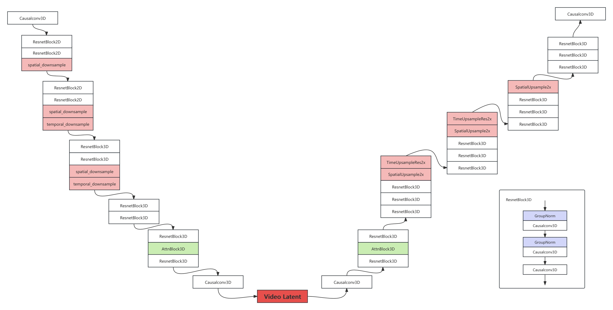

# CausalVideoVAE 简介与 MindSpore 实现
本文介绍了mindone/example/OpenSora-PKU中使用到的CausalVideoVAE模型构建。该模型位于目录[examples/opensora_pku/opensora/models/ae/videobase](https://github.com/mindspore-lab/mindone/tree/master/examples/opensora_pku/opensora/models/ae/videobase)下。

代码结构如下所示；
```python
.
├── causal-vas
├── losses
├── modules
├── utils
├── __init__.py
├── configuration_videobase.py
├── dataset_videobase.py
├── modeling-videobase.py
├── trainer-videobase.py
```
causal-vas目录定义了CausalVideoVAE的整体结构。modules目录包含了模型调用的一些模块，包括"CausalConv3d"、"ResnetBlock3D"和"AttnBlock3D"等。
## 1. CausalVideoVAE 结构简介
### 1.1. 模型结构：  



CausalVideoVAE的架构继承了[Stable-Diffusion Image VAE](https://github.com/CompVis/stable-diffusion/tree/main)的架构。并采取了下列优化措施：
1. CausalConv3D: 将Conv2D 转变成CausalConv3D可以实现图片和视频的联合训练. CausalConv3D 对第一帧进行特殊处理，因为它无法访问后续帧。用 CausalConv 替换常规 Conv。 （将第一帧重复k-1次，其中k表示卷积核的时间维度大小，从而将第一帧独立隔离为图像。）
使用插值加卷积进行上采样。
将时间压缩与空间压缩分开。空间压缩是通过2D卷积实现的，时间压缩是通过3D卷积实现的（填充空间以保证空间大小不变）。
将时间维度上的 Axial Attention 与 Causal Mask 结合起来，确保第一帧和其他帧不关联，并且每一帧仅与当前帧和前一帧相关。

2. 初始化：将Conv2D扩展到Conv3D常用的方法有两种：平均初始化和中心初始化。 但我们采用了特定的初始化方法（尾部初始化）。 这种初始化方法确保模型无需任何训练就能够直接重建图像，甚至视频。此章节简介不包含tilling的方法，有关的实现请参考(vae tilling实现)[https://github.com/Fzilan/tutorials/blob/master/aigc/opensora-pku_from_scratch/docs/vae_tiling_implement.md]

### 1.2. 代码实现
```python
class CausalVAEModel(VideoBaseAE):
    '''
    初始化，完成模型的建立。
    Args:

    解释一下主要参数的意思
    '''
    def __init__(
        self,
        lr: float = 1e-5,  # ignore
        hidden_size: int = 128,
        z_channels: int = 4,
        hidden_size_mult: Tuple[int] = (1, 2, 4, 4),
        attn_resolutions: Tuple[int] = [],
        dropout: float = 0.0,
        resolution: int = 256,
        double_z: bool = True,
        embed_dim: int = 4,
        num_res_blocks: int = 2,
        loss_type: str = "opensora.models.ae.videobase.losses.LPIPSWithDiscriminator",  # ignore
        loss_params: dict = {  # ignore
            "kl_weight": 0.000001,
            "logvar_init": 0.0,
            "disc_start": 2001,
            "disc_weight": 0.5,
        },
        q_conv: str = "CausalConv3d",
        encoder_conv_in: str = "CausalConv3d",
        encoder_conv_out: str = "CausalConv3d",
        encoder_attention: str = "AttnBlock3D",
        encoder_resnet_blocks: Tuple[str] = (
            "ResnetBlock3D",
            "ResnetBlock3D",
            "ResnetBlock3D",
            "ResnetBlock3D",
        ),
        encoder_spatial_downsample: Tuple[str] = (
            "SpatialDownsample2x",
            "SpatialDownsample2x",
            "SpatialDownsample2x",
            "",
        ),
        encoder_temporal_downsample: Tuple[str] = (
            "",
            "TimeDownsample2x",
            "TimeDownsample2x",
            "",
        ),
        encoder_mid_resnet: str = "ResnetBlock3D",
        decoder_conv_in: str = "CausalConv3d",
        decoder_conv_out: str = "CausalConv3d",
        decoder_attention: str = "AttnBlock3D",
        decoder_resnet_blocks: Tuple[str] = (
            "ResnetBlock3D",
            "ResnetBlock3D",
            "ResnetBlock3D",
            "ResnetBlock3D",
        ),
        decoder_spatial_upsample: Tuple[str] = (
            "",
            "SpatialUpsample2x",
            "SpatialUpsample2x",
            "SpatialUpsample2x",
        ),
        decoder_temporal_upsample: Tuple[str] = ("", "", "TimeUpsample2x", "TimeUpsample2x"),
        decoder_mid_resnet: str = "ResnetBlock3D",
        ckpt_path=None,
        ignore_keys=[],
        monitor=None,
        use_fp16=False,
        upcast_sigmoid=False,
    ):
        super().__init__()
        dtype = ms.float16 if use_fp16 else ms.float32

        # 构建 encoder
        self.encoder = Encoder(
            z_channels=z_channels,
            hidden_size=hidden_size,
            hidden_size_mult=hidden_size_mult,
            attn_resolutions=attn_resolutions,
            conv_in=encoder_conv_in,
            conv_out=encoder_conv_out,
            attention=encoder_attention,
            resnet_blocks=encoder_resnet_blocks,
            spatial_downsample=encoder_spatial_downsample,
            temporal_downsample=encoder_temporal_downsample,
            mid_resnet=encoder_mid_resnet,
            dropout=dropout,
            resolution=resolution,
            num_res_blocks=num_res_blocks,
            double_z=double_z,
            dtype=dtype,
            upcast_sigmoid=upcast_sigmoid,
        )

        # 构建 decoder
        self.decoder = Decoder(
            z_channels=z_channels,
            hidden_size=hidden_size,
            hidden_size_mult=hidden_size_mult,
            attn_resolutions=attn_resolutions,
            conv_in=decoder_conv_in,
            conv_out=decoder_conv_out,
            attention=decoder_attention,
            resnet_blocks=decoder_resnet_blocks,
            spatial_upsample=decoder_spatial_upsample,
            temporal_upsample=decoder_temporal_upsample,
            mid_resnet=decoder_mid_resnet,
            dropout=dropout,
            resolution=resolution,
            num_res_blocks=num_res_blocks,
            dtype=dtype,
            upcast_sigmoid=upcast_sigmoid,
        )
        quant_conv_cls = resolve_str_to_obj(q_conv)
        self.quant_conv = quant_conv_cls(2 * z_channels, 2 * embed_dim, 1)
        self.post_quant_conv = quant_conv_cls(embed_dim, z_channels, 1)

        self.embed_dim = embed_dim

        if monitor is not None:
            self.monitor = monitor
        if ckpt_path is not None:
            self.init_from_ckpt(ckpt_path, ignore_keys=ignore_keys)

        self.split = ops.Split(axis=1, output_num=2)
        self.concat = ops.Concat(axis=1)
        self.exp = ops.Exp()
        self.stdnormal = ops.StandardNormal()
        self.depend = ops.Depend() if get_sequence_parallel_state() else None

        self.tile_sample_min_size = 256
        self.tile_sample_min_size_t = 65
        self.tile_latent_min_size = int(self.tile_sample_min_size / (2 ** (len(hidden_size_mult) - 1)))
        t_down_ratio = [i for i in encoder_temporal_downsample if len(i) > 0]
        self.tile_latent_min_size_t = int((self.tile_sample_min_size_t - 1) / (2 ** len(t_down_ratio))) + 1
        self.tile_overlap_factor = 0.25
        self.use_tiling = False

    # 加载模型参数
    def init_from_ckpt(self, path, ignore_keys=list()):
        sd = ms.load_checkpoint(path)
        keys = list(sd.keys())
        for k in keys:
            for ik in ignore_keys:
                if k.startswith(ik):
                    logger.info("Deleting key {} from state_dict.".format(k))
                    del sd[k]

        ms.load_param_into_net(self, sd, strict_load=False)
        logger.info(f"Restored from {path}")

    @classmethod  # rewrite class method to load
    def from_pretrained(
        cls, pretrained_model_path, subfolder=None, checkpoint_path=None, ignore_keys=["loss."], **kwargs
    ):
        if subfolder is not None:
            pretrained_model_path = os.path.join(pretrained_model_path, subfolder)

        config_file = os.path.join(pretrained_model_path, "config.json")
        if not os.path.isfile(config_file):
            raise RuntimeError(f"{config_file} does not exist")
        with open(config_file, "r") as f:
            config = json.load(f)

        model = cls.from_config(config, **kwargs)
        if checkpoint_path is None or len(checkpoint_path) == 0:
            # search for ckpt under pretrained_model_path
            ckpt_paths = glob.glob(os.path.join(pretrained_model_path, "*.ckpt"))
            assert len(ckpt_paths) == 1, f"Expect to find one checkpoint file under {pretrained_model_path}"
            f", but found {len(ckpt_paths)} files that end with `.ckpt`"
            ckpt = ckpt_paths[0]
        else:
            ckpt = checkpoint_path
        model.init_from_ckpt(ckpt, ignore_keys=ignore_keys)

        return model

    def _encode(self, x):
        # return latent distribution, N(mean, logvar)
        h = self.encoder(x)
        moments = self.quant_conv(h)
        mean, logvar = self.split(moments)

        # 经过self.encoder前向传播后输出的 mean 和 log(var)的值
        return mean, logvar 

    def sample(self, mean, logvar):
        # sample z from latent distribution
        logvar = ops.clip_by_value(logvar, -30.0, 20.0)
        std = self.exp(0.5 * logvar) # 还原成var
        z = mean + std * self.stdnormal(mean.shape) # 生成和std长度相等的随机向量
        return z

    def encode(self, x):
        # embedding, get latent representation z
        posterior_mean, posterior_logvar = self._encode(x)
        z = self.sample(posterior_mean, posterior_logvar)

        return z

    def decode(self, z):
        z = self.post_quant_conv(z)
        dec = self.decoder(z)
        return dec

    def construct(self, input):
        # overall pass, mostly for training
        posterior_mean, posterior_logvar = self._encode(input)
        z = self.sample(posterior_mean, posterior_logvar)

        recons = self.decode(z)

        return recons, posterior_mean, posterior_logvar

    def validation_step(self, batch_idx):
        raise NotImplementedError
```


## 2. encoder
将三维视频转成低维的latent特征，并输入到隐空间中。encoder的结构请参考1.1.小结的左半部分。
主要包含CausalConv3d、AttnBlock3D、ResnetBlock2D、Downsample、TimeDownsampleRes2x等方法。
详见xxx todo。

代码实现如下：
```python 
class Encoder(nn.Cell):
    """
    default value aligned to v1.1 vae config.json
    """

    def __init__(
        self,
        z_channels: int = 4,
        hidden_size: int = 128,
        hidden_size_mult: Tuple[int] = (1, 2, 4, 4),
        attn_resolutions: Tuple[int] = (),
        conv_in: str = "Conv2d",
        conv_out: str = "CausalConv3d",
        attention: str = "AttnBlock3D",  # already fixed, same as AttnBlock3DFix
        resnet_blocks: Tuple[str] = (
            "ResnetBlock2D",
            "ResnetBlock2D",
            "ResnetBlock3D",
            "ResnetBlock3D",
        ),
        spatial_downsample: Tuple[str] = (
            "Downsample",
            "Downsample",
            "Downsample",
            "",
        ),
        temporal_downsample: Tuple[str] = (
            "",
            "TimeDownsampleRes2x",
            "TimeDownsampleRes2x",
            "",
        ),
        mid_resnet: str = "ResnetBlock3D",
        dropout: float = 0.0,
        resolution: int = 256,
        num_res_blocks: int = 2,
        double_z: bool = True,
        upcast_sigmoid=False,
        dtype=ms.float32,
        **ignore_kwargs,
    ):

        super().__init__()
        assert len(resnet_blocks) == len(hidden_size_mult), print(hidden_size_mult, resnet_blocks)
        self.num_resolutions = len(hidden_size_mult)
        self.resolution = resolution
        self.num_res_blocks = num_res_blocks

        self.dtype = dtype
        self.upcast_sigmoid = (upcast_sigmoid,)

        # 1. Input conv
        if conv_in == "Conv2d":
            self.conv_in = Conv2d(3, hidden_size, kernel_size=3, stride=1, pad_mode="pad", padding=1, has_bias=True)
        elif conv_in == "CausalConv3d":
            self.conv_in = CausalConv3d(
                3,
                hidden_size,
                kernel_size=3,
                stride=1,
                padding=1,
            )
        else:
            raise NotImplementedError

        # 2. Downsample
        curr_res = resolution
        in_ch_mult = (1,) + tuple(hidden_size_mult)
        self.in_ch_mult = in_ch_mult
        self.down = nn.CellList(auto_prefix=False)
        self.downsample_flag = [0] * self.num_resolutions
        self.time_downsample_flag = [0] * self.num_resolutions
        for i_level in range(self.num_resolutions):
            block = nn.CellList()
            attn = nn.CellList()
            block_in = hidden_size * in_ch_mult[i_level]  # input channels
            block_out = hidden_size * hidden_size_mult[i_level]  # output channels
            for i_block in range(self.num_res_blocks):
                block.append(
                    resolve_str_to_obj(resnet_blocks[i_level])(
                        in_channels=block_in,
                        out_channels=block_out,
                        dropout=dropout,
                        dtype=self.dtype,
                        upcast_sigmoid=upcast_sigmoid,
                    )
                )
                block_in = block_out
                if curr_res in attn_resolutions:
                    attn.append(resolve_str_to_obj(attention)(block_in, dtype=self.dtype))

            down = nn.Cell()
            down.block = block
            down.attn = attn

            # do spatial downsample according to config
            if spatial_downsample[i_level]:
                down.downsample = resolve_str_to_obj(spatial_downsample[i_level])(block_in, block_in, dtype=self.dtype)
                curr_res = curr_res // 2
                self.downsample_flag[i_level] = 1
            else:
                # TODO: still need it for 910b in new MS version?
                down.downsample = nn.Identity()

            # do temporal downsample according to config
            if temporal_downsample[i_level]:
                # TODO: add dtype support?
                down.time_downsample = resolve_str_to_obj(temporal_downsample[i_level])(block_in, block_in)
                self.time_downsample_flag[i_level] = 1
            else:
                # TODO: still need it for 910b in new MS version?
                down.time_downsample = nn.Identity()

            down.update_parameters_name(prefix=self.param_prefix + f"down.{i_level}.")
            self.down.append(down)

        # middle
        self.mid = nn.Cell()
        self.mid.block_1 = resolve_str_to_obj(mid_resnet)(
            in_channels=block_in,
            out_channels=block_in,
            dropout=dropout,
            dtype=self.dtype,
            upcast_sigmoid=upcast_sigmoid,
        )
        self.mid.attn_1 = resolve_str_to_obj(attention)(block_in, dtype=self.dtype)
        self.mid.block_2 = resolve_str_to_obj(mid_resnet)(
            in_channels=block_in,
            out_channels=block_in,
            dropout=dropout,
            dtype=self.dtype,
            upcast_sigmoid=upcast_sigmoid,
        )
        self.mid.update_parameters_name(prefix=self.param_prefix + "mid.")

        # end
        self.norm_out = nn.GroupNorm(num_groups=32, num_channels=block_in, eps=1e-6, affine=True)
        # self.norm_out = Normalize(block_in, extend=True)

        assert conv_out == "CausalConv3d", "Only CausalConv3d is supported for conv_out"
        self.conv_out = resolve_str_to_obj(conv_out)(
            block_in,
            2 * z_channels if double_z else z_channels,
            kernel_size=3,
            stride=1,
            padding=1,
        )

    def construct(self, x):
        # downsampling
        hs = self.conv_in(x)
        h = hs
        for i_level in range(self.num_resolutions):
            for i_block in range(self.num_res_blocks):
                # import pdb; pdb.set_trace()
                h = self.down[i_level].block[i_block](hs)
                if len(self.down[i_level].attn) > 0:
                    h = self.down[i_level].attn[i_block](h)
                hs = h
            # if hasattr(self.down[i_level], "downsample"):
            #    if not isinstance(self.down[i_level].downsample, nn.Identity):
            if self.downsample_flag[i_level]:
                hs = self.down[i_level].downsample(hs)
            # if hasattr(self.down[i_level], "time_downsample"):
            #    if not isinstance(self.down[i_level].time_downsample, nn.Identity):
            if self.time_downsample_flag[i_level]:
                hs_down = self.down[i_level].time_downsample(hs)
                hs = hs_down

        # middle
        # h = hs[-1]
        h = self.mid.block_1(h)
        h = self.mid.attn_1(h)
        h = self.mid.block_2(h)

        # end
        h = self.norm_out(h)
        h = nonlinearity(h, upcast=self.upcast_sigmoid)
        h = self.conv_out(h)
        return h
```
## 3. decoder
将低维的latent特征还原成三维视频。decoder的结构请参考1.1.小结的右半部分。  
主要包含CausalConv3d、AttnBlock3D、ResnetBlock3D、Downsample、SpatialUpsample2x、TimeUpsampleRes2x等方法。详见xxx todo。

代码实现如下：
```python 
class Decoder(nn.Cell):
    """
    default value aligned to v1.1 vae config.json
    """

    def __init__(
        self,
        z_channels: int = 4,
        hidden_size: int = 128,
        hidden_size_mult: Tuple[int] = (1, 2, 4, 4),
        attn_resolutions: Tuple[int] = (),
        conv_in: str = "CausalConv3d",
        conv_out: str = "CausalConv3d",
        attention: str = "AttnBlock3D",  # already fixed, same as AttnBlock3DFix
        resnet_blocks: Tuple[str] = (
            "ResnetBlock3D",
            "ResnetBlock3D",
            "ResnetBlock3D",
            "ResnetBlock3D",
        ),
        spatial_upsample: Tuple[str] = ("", "SpatialUpsample2x", "SpatialUpsample2x", "SpatialUpsample2x"),
        temporal_upsample: Tuple[str] = ("", "", "TimeUpsampleRes2x", "TimeUpsampleRes2x"),
        mid_resnet: str = "ResnetBlock3D",
        dropout: float = 0.0,
        resolution: int = 256,
        num_res_blocks: int = 2,
        double_z: bool = True,
        upcast_sigmoid=False,
        dtype=ms.float32,
        **ignore_kwargs,
    ):
        super().__init__()

        self.num_resolutions = len(hidden_size_mult)
        self.resolution = resolution
        self.num_res_blocks = num_res_blocks

        self.dtype = dtype
        self.upcast_sigmoid = upcast_sigmoid

        # 1. decode input z conv
        # compute in_ch_mult, block_in and curr_res at lowest res
        block_in = hidden_size * hidden_size_mult[self.num_resolutions - 1]
        curr_res = resolution // 2 ** (self.num_resolutions - 1)
        # self.z_shape = (1, z_channels, curr_res, curr_res)
        # logger.info("Working with z of shape {} = {} dimensions.".format(self.z_shape, np.prod(self.z_shape)))

        # z to block_in
        assert conv_in == "CausalConv3d", "Only CausalConv3d is supported for conv_in in Decoder currently"
        self.conv_in = CausalConv3d(z_channels, block_in, kernel_size=3, padding=1)

        # 2. middle
        self.mid = nn.Cell()
        self.mid.block_1 = resolve_str_to_obj(mid_resnet)(
            in_channels=block_in, out_channels=block_in, dropout=dropout, dtype=self.dtype
        )
        self.mid.attn_1 = resolve_str_to_obj(attention)(block_in, dtype=self.dtype)
        self.mid.block_2 = resolve_str_to_obj(mid_resnet)(
            in_channels=block_in, out_channels=block_in, dropout=dropout, dtype=self.dtype
        )
        self.mid.update_parameters_name(prefix=self.param_prefix + "mid.")

        # 3. upsampling
        self.up = nn.CellList(auto_prefix=False)
        self.upsample_flag = [0] * self.num_resolutions
        self.time_upsample_flag = [0] * self.num_resolutions
        # i_level: 3 -> 2 -> 1 -> 0
        for i_level in reversed(range(self.num_resolutions)):
            block = nn.CellList()
            attn = nn.CellList()
            block_out = hidden_size * hidden_size_mult[i_level]
            for i_block in range(self.num_res_blocks + 1):
                block.append(
                    resolve_str_to_obj(resnet_blocks[i_level])(
                        in_channels=block_in,
                        out_channels=block_out,
                        dropout=dropout,
                        dtype=self.dtype,
                    )
                )
                block_in = block_out
                if curr_res in attn_resolutions:
                    attn.append(resolve_str_to_obj(attention)(block_in, dtype=self.dtype))
            up = nn.Cell()
            up.block = block
            up.attn = attn
            # do spatial upsample x2 except for the first block
            if spatial_upsample[i_level]:
                up.upsample = resolve_str_to_obj(spatial_upsample[i_level])(block_in, block_in, dtype=self.dtype)
                curr_res = curr_res * 2
                self.upsample_flag[i_level] = 1
            else:
                up.upsample = nn.Identity()
            # do temporal upsample x2 in the bottom tc blocks
            if temporal_upsample[i_level]:
                # TODO: support dtype?
                up.time_upsample = resolve_str_to_obj(temporal_upsample[i_level])(block_in, block_in)
                self.time_upsample_flag[i_level] = 1
            else:
                up.time_upsample = nn.Identity()

            up.update_parameters_name(prefix=self.param_prefix + f"up.{i_level}.")
            if len(self.up) != 0:
                self.up.insert(0, up)
            else:
                self.up.append(up)

        # end
        self.norm_out = nn.GroupNorm(num_groups=32, num_channels=block_in, eps=1e-6, affine=True)
        # self.norm_out = Normalize(block_in, extend=True)

        assert conv_out == "CausalConv3d", "Only CausalConv3d is supported for conv_out in Decoder currently"
        self.conv_out = CausalConv3d(block_in, 3, kernel_size=3, padding=1)

    def construct(self, z):
        # z to block_in
        h = self.conv_in(z)

        # middle
        h = self.mid.block_1(h)
        h = self.mid.attn_1(h)
        h = self.mid.block_2(h)

        # upsampling
        i_level = self.num_resolutions
        while i_level > 0:
            i_level -= 1
            for i_block in range(self.num_res_blocks + 1):
                h = self.up[i_level].block[i_block](h)
                if len(self.up[i_level].attn) > 0:
                    h = self.up[i_level].attn[i_block](h)
            # if hasattr(self.up[i_level], 'upsample'):
            #    if not isinstance(self.up[i_level].upsample, nn.Identity):
            if self.upsample_flag[i_level]:
                h = self.up[i_level].upsample(h)

            # if hasattr(self.up[i_level], 'time_upsample'):
            #    if not isinstance(self.up[i_level].time_upsample, nn.Identity):
            if self.time_upsample_flag[i_level]:
                h = self.up[i_level].time_upsample(h)

        # end
        h = self.norm_out(h)
        h = nonlinearity(h, upcast=self.upcast_sigmoid)
        h = self.conv_out(h)
        return h
```
